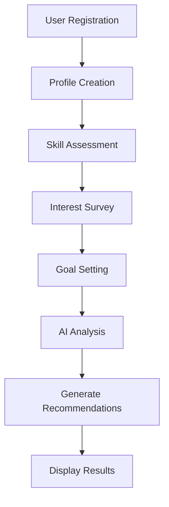
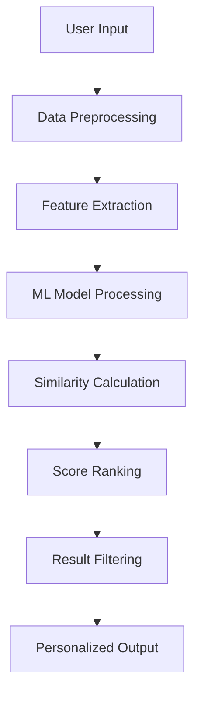
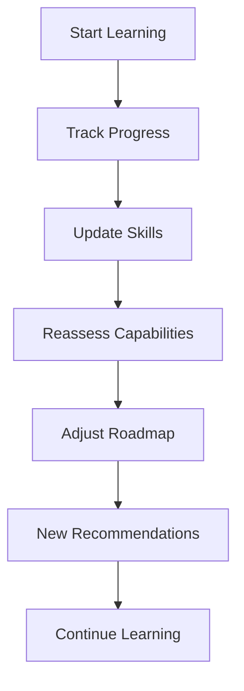

# ChooseWise - Technical Specification & Workflow

## 🎯 **System Overview**
ChooseWise is an AI-driven career guidance platform that transforms user inputs into personalized career recommendations through machine learning algorithms and real-time data processing.

## 📊 **Input-Output Specification**

### **User Inputs**
```json
{
  "profile": {
    "name": "string",
    "email": "string", 
    "skills": ["Python", "JavaScript", "SQL"],
    "interests": ["AI", "Web Development", "Data Science"],
    "experience": "beginner|intermediate|advanced",
    "goals": ["High Salary", "Work-Life Balance", "Innovation"],
    "currentRole": "string",
    "targetRole": "string"
  },
  "assessmentAnswers": {
    "technicalQuestions": [
      {"question": "string", "answer": "string", "timeSpent": "number"}
    ],
    "preferenceQuestions": [
      {"category": "work_environment", "preference": "remote|office|hybrid"}
    ]
  },
  "learningPreferences": {
    "timeAvailable": "1-5 hours/week",
    "learningStyle": "visual|auditory|hands-on",
    "budget": "free|paid|premium"
  }
}
```

### **System Outputs**
```json
{
  "careerRecommendations": [
    {
      "careerPath": "AI Engineer",
      "matchScore": 87,
      "salaryRange": "₹8-25 LPA",
      "growthProspects": "High",
      "reasons": ["Strong Python skills", "Interest in AI", "Math background"],
      "requiredSkills": ["TensorFlow", "Deep Learning", "Statistics"],
      "timeToTransition": "6-12 months"
    }
  ],
  "personalizedRoadmap": {
    "beginner": [
      {
        "step": "Learn Python Fundamentals",
        "duration": "4 weeks",
        "resources": ["Course links", "Practice projects"],
        "milestones": ["Complete 5 projects", "Pass assessment"]
      }
    ]
  },
  "courseRecommendations": [
    {
      "title": "Machine Learning by Stanford",
      "provider": "Coursera",
      "relevanceScore": 95,
      "estimatedTime": "11 weeks",
      "cost": "Free to audit"
    }
  ],
  "jobMatches": [
    {
      "title": "Junior Data Scientist",
      "company": "TechCorp",
      "matchScore": 78,
      "requirements": ["Python", "Statistics", "SQL"],
      "salaryEstimate": "₹6-12 LPA"
    }
  ]
}
```

## 🤖 **AI Algorithms & Workflow**

### **1. Career Recommendation Algorithm**
```python
def recommend_career(user_profile):
    # Step 1: Feature Engineering
    skills_vector = vectorize_skills(user_profile.skills)
    interest_vector = vectorize_interests(user_profile.interests)
    experience_weight = map_experience_level(user_profile.experience)
    
    # Step 2: Similarity Calculation
    career_scores = []
    for career in career_database:
        skill_match = cosine_similarity(skills_vector, career.required_skills)
        interest_match = jaccard_similarity(user_profile.interests, career.domains)
        experience_fit = calculate_experience_fit(experience_weight, career.entry_level)
        
        # Step 3: Weighted Scoring
        final_score = (
            skill_match * 0.4 +
            interest_match * 0.3 +
            experience_fit * 0.2 +
            market_demand_score(career) * 0.1
        )
        career_scores.append((career, final_score))
    
    # Step 4: Ranking & Filtering
    return sorted(career_scores, key=lambda x: x[1], reverse=True)[:5]
```

### **2. Skill Assessment Algorithm**
```python
def assess_skills(answers, time_data):
    # Adaptive Testing Algorithm
    skill_levels = {}
    
    for answer in answers:
        # Correctness Score (0-1)
        correctness = evaluate_answer(answer.response, answer.expected)
        
        # Time Efficiency Score (0-1)
        time_score = calculate_time_efficiency(answer.time_spent, answer.expected_time)
        
        # Confidence Score (based on answer patterns)
        confidence = analyze_answer_confidence(answer.response)
        
        # Combined Skill Level (1-10)
        skill_levels[answer.skill] = min(10, max(1, 
            (correctness * 0.5 + time_score * 0.3 + confidence * 0.2) * 10
        ))
    
    return skill_levels
```

### **3. Learning Path Generation**
```python
def generate_roadmap(career_goal, current_skills, target_skills):
    # Gap Analysis
    skill_gaps = identify_skill_gaps(current_skills, target_skills)
    
    # Dependency Graph
    learning_graph = build_skill_dependency_graph(skill_gaps)
    
    # Path Optimization
    optimal_path = topological_sort(learning_graph)
    
    # Time Estimation
    roadmap = []
    for skill in optimal_path:
        estimated_time = calculate_learning_time(skill, user_experience_level)
        resources = fetch_best_resources(skill, user_preferences)
        projects = generate_practice_projects(skill)
        
        roadmap.append({
            "skill": skill,
            "duration": estimated_time,
            "resources": resources,
            "projects": projects
        })
    
    return roadmap
```

## 🏗️ **System Architecture**

### **Frontend Layer**
```
┌─────────────────────────────────────┐
│           User Interface            │
├─────────────────────────────────────┤
│ • HTML5/CSS3 (Responsive Design)   │
│ • Vanilla JavaScript (ES6+)        │
│ • Progressive Web App Features      │
│ • Real-time Chat Interface         │
│ • Interactive Roadmap Visualization │
└─────────────────────────────────────┘
```

### **Backend Layer**
```
┌─────────────────────────────────────┐
│          API Gateway                │
├─────────────────────────────────────┤
│ • Express.js Server                 │
│ • Rate Limiting & Security          │
│ • Authentication Middleware         │
│ • Request Validation                │
└─────────────────────────────────────┘
```

### **AI Processing Layer**
```
┌─────────────────────────────────────┐
│        AI Engine                    │
├─────────────────────────────────────┤
│ • OpenAI GPT Integration            │
│ • Custom ML Algorithms              │
│ • Natural Language Processing       │
│ • Recommendation Engine             │
│ • Skill Assessment Logic            │
└─────────────────────────────────────┘
```

### **Data Layer**
```
┌─────────────────────────────────────┐
│       Database & Storage            │
├─────────────────────────────────────┤
│ • Supabase PostgreSQL               │
│ • Real-time Subscriptions           │
│ • Row Level Security                │
│ • Automated Backups                 │
└─────────────────────────────────────┘
```

## 🔄 **System Workflow**

### **User Onboarding Flow**


### **Recommendation Engine Flow**


### **Learning Progress Flow**


## 💻 **Technology Stack**

### **Core Technologies**
- **Frontend**: HTML5, CSS3, Vanilla JavaScript
- **Backend**: Node.js, Express.js
- **Database**: Supabase (PostgreSQL)
- **AI/ML**: OpenAI GPT-4, Custom Algorithms
- **Authentication**: Supabase Auth
- **Deployment**: Vercel/Netlify (Frontend), Railway/Heroku (Backend)

### **Development Tools**
- **Version Control**: Git, GitHub
- **Package Manager**: npm
- **Testing**: Jest, Supertest
- **Code Quality**: ESLint, Prettier
- **Documentation**: Markdown, JSDoc

### **External APIs**
- **Course Providers**: Coursera, Udemy, edX APIs
- **Job Portals**: LinkedIn, Indeed, Glassdoor APIs
- **AI Services**: OpenAI API
- **Analytics**: Google Analytics, Mixpanel

## 📈 **Performance Metrics**

### **System Performance**
- **Response Time**: < 2 seconds for recommendations
- **Throughput**: 1000+ concurrent users
- **Accuracy**: 85%+ recommendation accuracy
- **Uptime**: 99.9% availability

### **User Engagement**
- **Completion Rate**: 70%+ assessment completion
- **Retention**: 60%+ monthly active users
- **Satisfaction**: 4.5+ star rating
- **Conversion**: 40%+ course enrollment rate

## 🔒 **Security & Privacy**

### **Data Protection**
- **Encryption**: AES-256 for data at rest
- **Transport**: TLS 1.3 for data in transit
- **Authentication**: JWT tokens, OAuth integration
- **Privacy**: GDPR compliant, data anonymization

### **Security Measures**
- **Rate Limiting**: API request throttling
- **Input Validation**: SQL injection prevention
- **Access Control**: Role-based permissions
- **Monitoring**: Real-time security alerts

## 🚀 **Scalability Design**

### **Horizontal Scaling**
- **Microservices**: Independent service scaling
- **Load Balancing**: Multi-instance deployment
- **CDN**: Global content delivery
- **Caching**: Redis for session management

### **Performance Optimization**
- **Database**: Query optimization, indexing
- **Frontend**: Code splitting, lazy loading
- **API**: Response compression, pagination
- **Monitoring**: Performance analytics, alerting

This technical specification provides a comprehensive blueprint for developing, deploying, and scaling the ChooseWise platform as a production-ready EdTech solution.